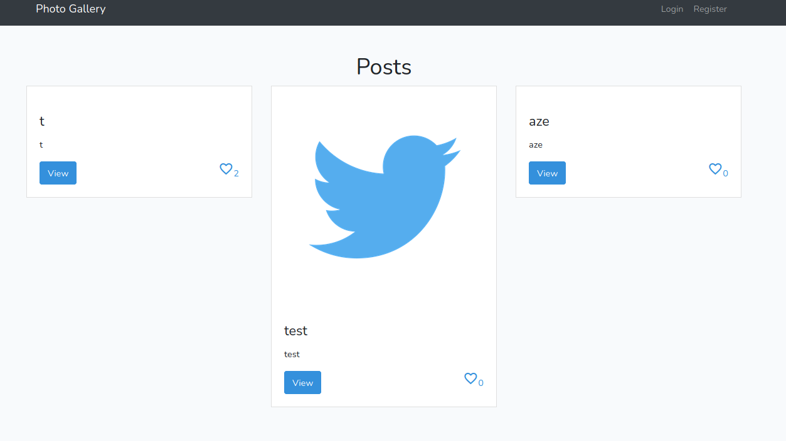
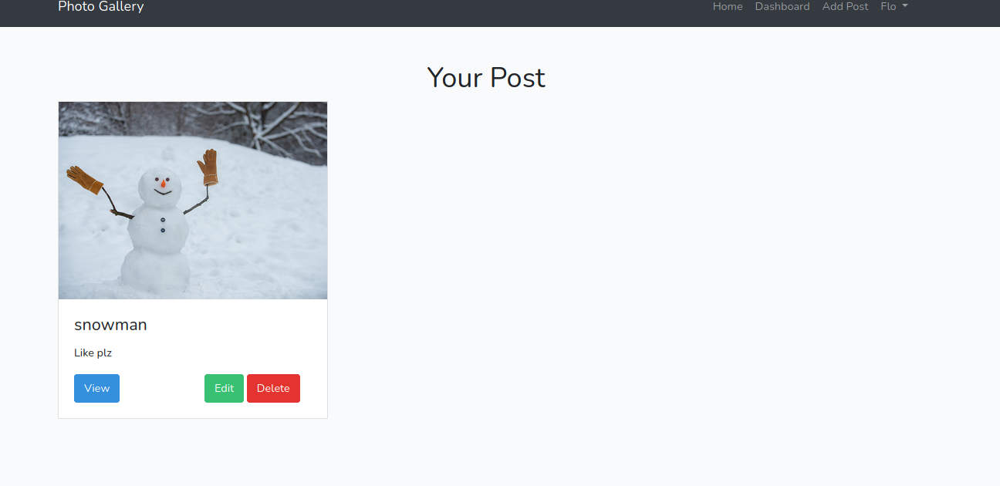
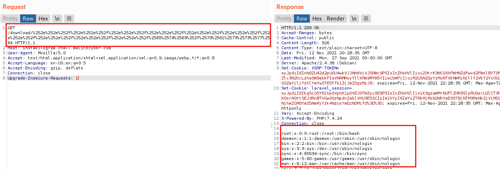
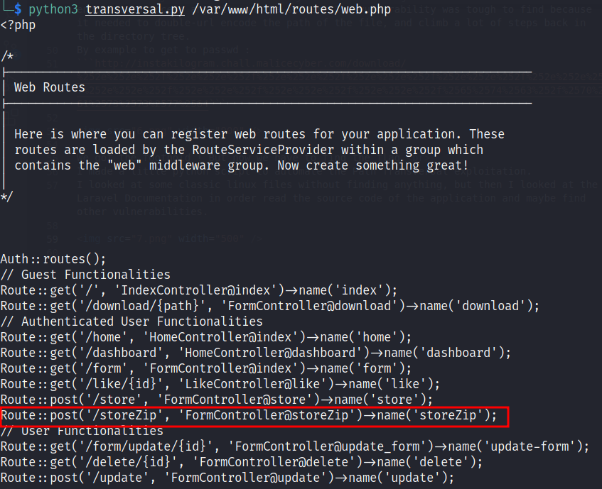
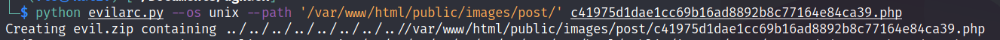
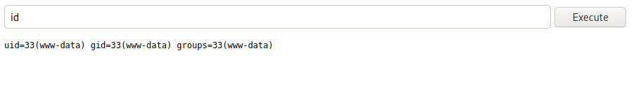

# Instakilogram  - Medium
## Description
___
<p>I have a friend who got an idea which will explode in the market : </p>
It's like Instagram, but its in PHP instead of Python. Everyone knows that PHP is better than Python, moreover, we could take interns to code the website without cost !
Here is what my interns team gave me, can you tell me if I can put it in production next friday ?

We are given the url of the website: http://instakilogram.chall.malicecyber.com/


<br>
<br>

## Solution
___

The website is very funny because everyone can create an account and like or post random pics, with a title and a categorie that everyone can see.
<br>
<p align="center">
  
</p>

<br>
It is also possible to manipulate our posts on our dashboard. We can update them, delete them or view them:
<br>
<br>
<p align="center">
  
</p>
<br>
<br>
<br>
I played a lot with the website: 

    - The website is using Laravel framework
    - It use multiple API endpoints to manipulate the posts
    - There is a filter in order to prevent uploading non-image content
    - Having an account allow to manipulate posts

The website suffers of some flaws: It is possible to modify other's people post, create some weird XSS without big consequences or even make the main page of the server crash by crafting special extension in the name of image to upload. It's also possible to bypass the type check and the extension check. But it is not possible to upload a .php file
The solution was elsewhere :
There are two ways to access the content uploaded by users.

- First method is to access the picture with the View button, which redirect to http://instakilogram.chall.malicecyber.com/download/-2021-11-12-618ec78d21a9c.jpg and the /download endpoint.
- Second method, which can be seen when the page is rendering the pictures preview in the browser, is to access the url : http://instakilogram.chall.malicecyber.com/images/post/-2021-11-12-618ec78d21a9c.jpg. This last method is not an API endpoint, this is the folder where the pictures are actually stored on the server.
Note that files uploaded on the server are renamed with the date and an unique timestamp-based ID, keeping the extension.

So we can upload file and access them but we can't upload a php file in order to have code execution on the server. What if there is a flaw in the download API endpoint function ?
After some time, I managed to exploit a Path Transversal vulnerability on the download endpoint to access any file on the server. The vulnerability was tough to find because it needed to double-url encode the path of the file, and climb a lot of steps back in the directory tree.
By example to get to passwd :
```http://instakilogram.chall.malicecyber.com/download/%252e%252e%252f%252e%252e%252f%252e%252e%252f%252e%252e%252f%252e%252e%252f%252e%252e%252f%252e%252e%252f%252e%252e%252f%252e%252e%252f%252e%252e%252f%2565%2574%2563%252f%2570%2561%2573%2573%2577%2564```



We got the foothold ! But now we have to find the flag.<br>
I made a little python script to automate the Path Transversal exploitation.
I looked at some classic linux files without finding anything, but then I looked at the Laravel Documentation in order read the source code of the application and maybe find other vulnerabilities.

I looked at the .env of the Laravel application and find the App_Key, but that was not useful here. I tried to access all the API endpoints (routes) registered in the application, located in the file routes/web.php in the Laravel application



That's weird, what's this /storeZip endpoint ? Nothing mention such a functionnality on the website. Let's try to find the code source of this endpoint in the FormController file, located in the Controller folder so app/Http/Controllers/FormController.php on the Laravel application
```python3 transversal.py /var/www/html/app/Http/Controllers/FormController.php```

We code the source code of various API endpoints, and /storeZip endpoint :
```
public function storeZip(Request $request)
    {
        $this->validate($request,[
            'path' => 'required|mimes:zip,x-tar,gzip,x-bzip2',
            'categories' => 'required|max:10',
            'title' => 'required|max:10',
        ]);

        $zipper = new \Chumper\Zipper\Zipper;

        $zipArchive = $request->file('path');
        $slug = str_slug($request->name);
        if (isset($zipArchive))
        {
            $currentDate = Carbon::now()->toDateString();
            $zipName = $slug.'-'.$currentDate.'-'. uniqid() .'.'. $zipArchive->getClientOriginalExtension();

            $zipArchive->move('/tmp/',$zipName);

            $zipper->make('/tmp/' . $zipName)->extractTo('/tmp');


        }else{
            $imagename = "default.png";
         }
          return redirect()->back()->with('message', 'Post Added');
    `
```
We can see that when the endpoint /storeZip is called with a form : :
- It check the file type in order to accept only archive type, it also check the size of the categorie and the title field, like for the posts
- It transforms the archive name with the date and the based-timestamp id, keep the extension like the posts.
- It moves the archive in the /tmp folder, then extract it in the /tmp folder.

This extraction method could be vulnerable, I looked on the Internet for a vulnerability in the Chumper Zipper package and found this post : https://security.snyk.io/vuln/SNYK-PHP-CHUMPERZIPPER-552162
It appears that prior version 1.0.3, it was possible to extract the file to an other directory with a Path Transversal vulnerability via the name of one of the file in the archive.
By example unzipping a file named ../var/www/file.txt, will trick the package and extract the file not in the /tmp directory, but in /var/www
Maybe the package is not updated on the website ! We could try to create an archive which contains a php file with an evil filename to trick the zipper and extract it to a location we could access, like /var/www/html/public/images/post/

I found an useful python tool which can craft this kind of archive: https://github.com/ptoomey3/evilarc
I put in the archive a simple php webshell with an evil name to path transversal to /var/www/html/public/images/post/ :

We then upload the evil.zip archive to http://instakilogram.chall.malicecyber.com/storeZip

Then we visit the path where our php webshell is supposed to have been extraxted: 
.... And we get a shell !!


The flag was in a file at the root of the file system : DGHACK{c0231e30879a593610f10c714fcca7b35b313536}