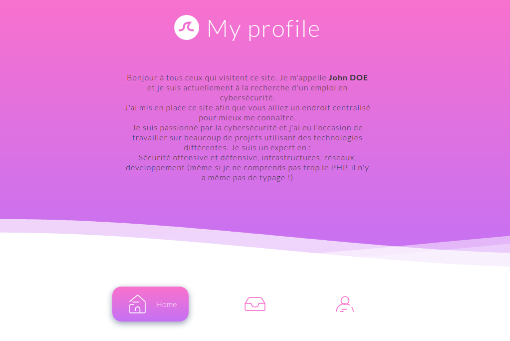
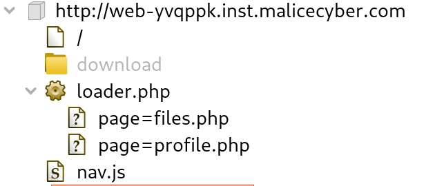
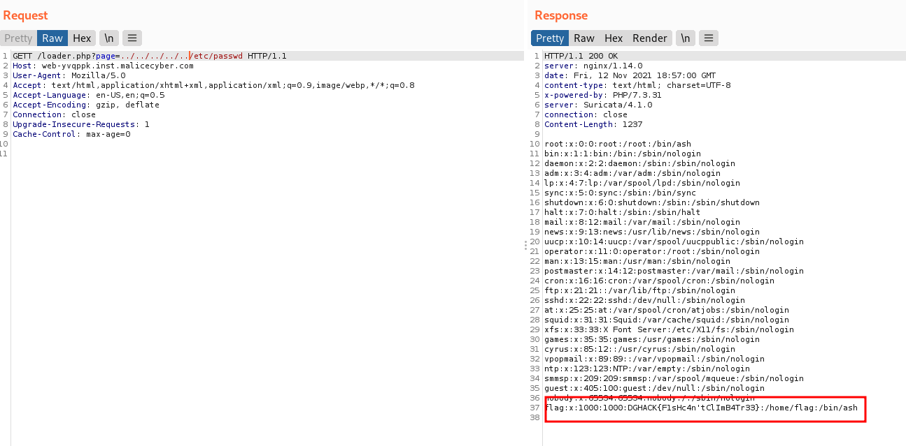

# Pretty Vulnerability  - Easy

## Description
___
<p>One of my friend decided to create an online portfolio in order to support his application to DGA. I told him that there is a vulnerability but I did not go further without authorization. He does not believe me and he challenged me to find the GECOS field of flag user. Apparently, he told his server host and a protection has been deployed</p>

We are given the url of the website: http://web-yvqppk.inst.malicecyber.com/


<br>
<br>

## Solution
___
The website has not many functionnalities, we can either see the profile tab, the home tab, the profile tab and the CV tab. We can download a pdf this last one.

<p align="center">
  
</p>

<br>

The description say that we are looking for the GECOS field of the user 'flag' it means that we have to find a way to get the content of /etc/passwd
That's an important indication because it means we are more likely looking for a Path transversal or an File inclusion Vulnerability.
After playing a little with the website with Burp open, we can see in target that the content of each tab is called via loader.php.<br>

  

<br>
<br>
Let's try to call this url to open /etc/passwd:
```
http://web-yvqppk.inst.malicecyber.com/?loader.php=../../../../../../../etc/passwd
```
The server takes a lot of time to answer with a time out status. It means that something dropped our packets somehow. Looking at the answer, we can notice several headers:
```HTTP/1.1 200 OK
server: nginx/1.14.0
date: Fri, 12 Nov 2021 18:45:54 GMT
content-type: text/html; charset=UTF-8
x-powered-by: PHP/7.3.31
server: Suricata/4.1.0
connection: close
Content-Length: 6766
```
We got there some informations, notice the **server: Suricata/4.1.0** header<br>
Suricata is an open source-based IDS / IPS, this is probably the protection deployed by the host. After playing to access some pages, we can state that the protection rules is something like :
If 'loader' is find in the url, then the url must not contain neither '/', '\\' or '..' That's make File inclusion attempts very complicated.
I tried for some time to encode the characters, but it appears the solution is simplier :
I tried to change the request method with POST to access the normal pages content like profile.php and it worked. It seems that the method is not so important to get the page.
Maybe the rule is too permissive and we can try a Verb Tampering attack ? (non-existent HTTP Method) to not be catched by the Suricata rule ? By example, trying a 'GETT' method ?

<p align="center">
  
</p>

Here we go ! We got the flag : DGHACK{F1sHc4n'tClImB4Tr33}